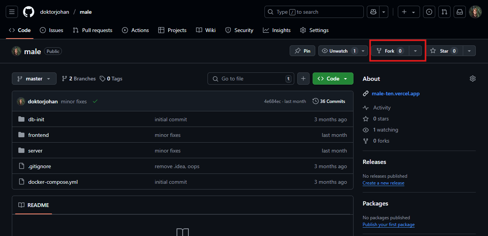
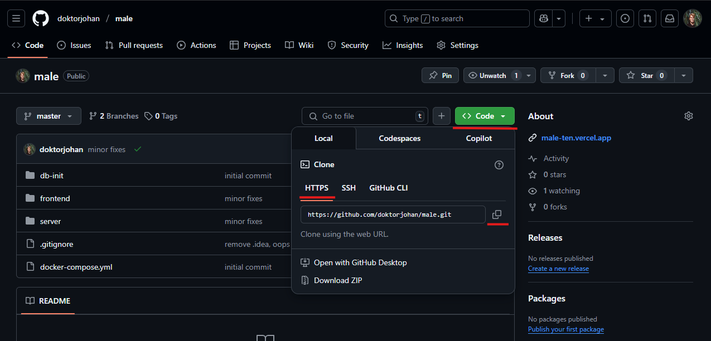

# Male andmebaas - nüüd siis rakendusena

---

## ⚠️ NB! ⚠️
Minu andmebaasi versioonis puudub `asulad` veerg tabelis `klubid`.  
Seetõttu on muudetud `SELECT_CLUB_BY_ID` päring:

```js
const SELECT_CLUB_BY_ID = `
    SELECT k.nimi, k.asukoht, f_klubisuurus($1) AS members, ROUND(AVG(i.ranking), 1) AS average_rating
    FROM klubid k
    LEFT JOIN isikud i ON k.id = i.klubis
    WHERE k.id = $1
    GROUP BY k.nimi, k.asukoht
`;
```

---
## Setup

---
### 0. Kui sul ei ole installitud ```git bash```, ```node.js``` ja```npm``` 

Õpetuse leiad siit: [Installimise õpetus](INSTALL.md)

### 1. Tee FORK sellest repositooriumist


See teeb sulle isikliku koopia sellest repositoorimumist. Selle **isikliku koopiaga** hakkad edaspidi töötama.
https://docs.github.com/en/get-started/quickstart/fork-a-repo

### 2. Klooni endale repo (enda oma, see mis just forkitud sai)


1. Kopeeri repo link
2. Tee endale projekti kaust
3. Liigu projekti kausta ja klooni repo (asenda <projekti_kaust> ja <repo_link> õigete väärtustega)

```bash
cd <projekti_kaust>
git clone <repo_link>
```

### 3. Liigu repo kausta ja installi vajalikud teegid

```bash
cd <repo_kaust>
```
```bash
npm install
```

### 4. Proovi jooksutada arendusserverit

```bash
npm run serve
```

### 5. Säti rakendus enda andmebaasi kasutama

Selleks liigu database.js faili ja muuda ära andmebaasi ühendamise parameetrid vastavalt oma andmebaasile. Kontrolli ka, et su andmebaas jookseks.

## Boonusülesanne

---

### Ülesande leiad: [Boonusülesanne](BOONUS.md)